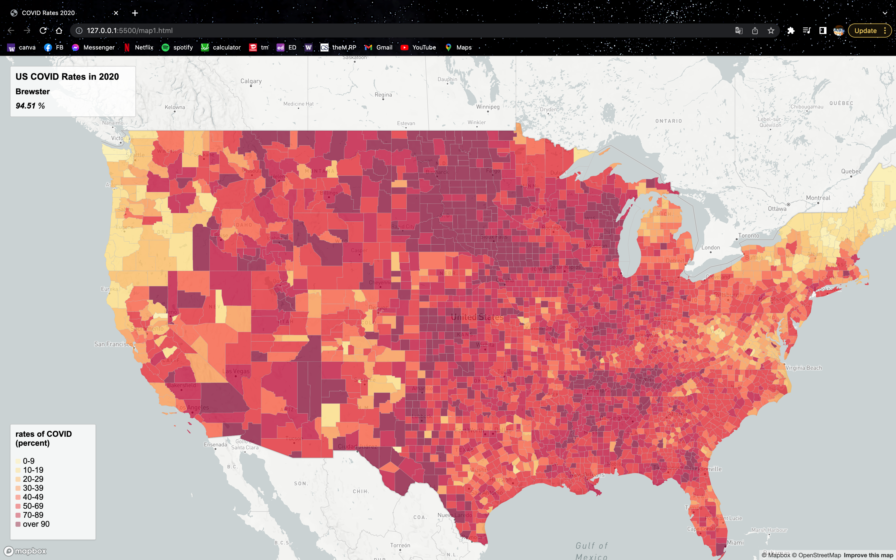

# Lab 3: COVID MAPS

**Author:** Yi-Yang Su

## 1. Display the Rates Of COVID In Each County
[COVID Rates 2020](https://ivansu1999.github.io/USCOVID2020RatesAndCount/map1.html)
This is the first map I designed that shows the rates of residents geting COVID till 2020 in each county of the United States.

The structure of the code was mainly from the given link step of the previous lab. [step-by-step lab tutorial](https://github.com/jakobzhao/geog495/tree/main/labs/lab04). The major changes that I added to it are:

1. Adding text to all required information boxes.
2. Inputing the 'rates' data.
3. Adding the 'Albers' projection.
4. Set the start location to the center of United States.
5. Set the starting zoom as 4.3 for viewing the entier country.
6. Adding the resourse to the of the data in the legend.

**Source:** The shapefile data was from the US Census, and been converted to Geojson data by using the online tool [mapshaper](https://mapshaper.org/).

**Fun Fact:** After coding the map, I realize there are some counties that has rates over 100 percents getting COVID and started to questioin why is this happening. 

## 2. Display the Cases Of COVID In Each County
[US COVID 2020 Counts](https://ivansu1999.github.io/USCOVID2020RatesAndCount/map2.html)
This is the second map I designed that shows the number of cases of residents geting COVID till 2020 in each county of the United States.

The structure of the code was mainly from the given example of this lab. The major changes that I added to it are:

1. Adding text to all required information boxes.
2. Inputing the 'cases' data.
3. Adding the 'Albers' projection.
4. Set the start location to the center of United States.
5. Set the starting zoom as 5 for viewing the entier country.
6. Adding the resourse to the of the data in the legend.

**Source:** The shapefile data was from the US Census, and been converted to Geojson data by using the online tool [mapshaper](https://mapshaper.org/).

**Fun Fact:** After coding the map, I Discovered that when I set the zoom too small, the data will not first showed up until I enlarge the map. Simultaneously, when the maps placed too left, the data on the right will also disappear.

